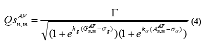
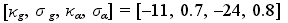
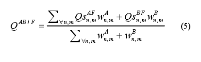
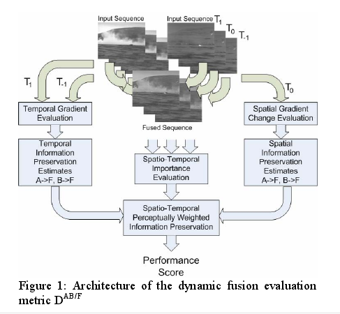
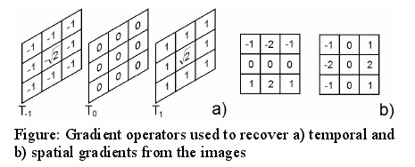
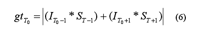
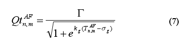
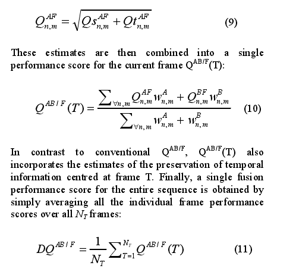

## Q指数的计算
* 用sobel操作获得每个像素的方向alpha和梯度值g 

 

通过(2)(3)算出每个像素的G和A值。注意两幅图像得到一个映射结果。G的值为1表明两个图的该点的方向梯度值相同，最相近。值不会取到0，如果接近0的话说明差别很大。另外如果有0值。就取G为1，认定为背景区域。背景部分在不同传感器下应该都是背景部分。对于A的值，如果相同则为1,当相差为pi/2时值为0。注意这里的绝对值。是为了设定差值pi/2则表示方向上差别最多。

* 通过（4）可以把上述两个指数糅合到一个指标里面。里面的参数都是实验数据。

 

上式中的取值如下：。分子那一项可以说是为了归一化而设定的。当G和A的为1的时候，综合指数QS也应该为1.
按照这个参数，计算结果为**1.0224**.

  * 最后为了应用于图像融合的评价，需要包括两幅原始图像的信息。用下公式得到最后的Q值。其中w也就是上面指出的g值
。
   
 

[参考文献](realDQ.pdf)中指出传统的对视频评价方式为一帧帧处理。所以提出了**Dynamic fusion**评价方法

## DQ的计算
*  框架图如下： 

* 从图中可以看出，分两个部分进行计算。针对特定一帧T0，计算它的Qs值。计算方法参照上一部分。文中成为空间信息。

*  还需要算出空间信息。 
 

通过上线a)中指出的空间模板。计算出时间上的梯度。实现上每一帧只需要算一次用conv2来算一次。等价于前帧减后帧的卷积。如下公式所述，需要取一下绝对值 
 

这样就得到了`gt`。再通过(2)得到GT。然后类似于(4)获得Qt的值。因为这里没有方向的问题（所有方向都相同），所以直接得到公式(7)） 
 
其中参数算法都一样，这里计算出来分子为**1.0183**
*  最后3个公式没什么好理解的了 
 
最后得到DQ值

st enrygy :  0.8795   0.8793  
st motion :  0.8179   0.8177  
DWT 3D    :  0.8838   0.8837  
DWT 2D    :  0.8698   0.8697  